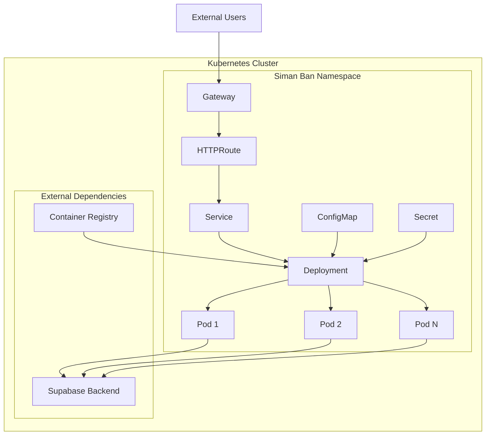

# Design Document

## Overview

This design outlines the implementation of a comprehensive Helm chart for deploying the Siman Ban dashboard (Next.js application) to Kubernetes clusters. The chart will follow Kubernetes best practices and provide a production-ready deployment solution with configurable options for different environments. The design leverages Gateway API for modern ingress management and includes proper security, monitoring, and scalability features.

## Architecture

### High-Level Architecture



### Component Relationships

1. **Gateway**: Provides cluster-wide ingress configuration
2. **HTTPRoute**: Routes specific paths to the dashboard service
3. **Service**: Load balances traffic to deployment pods
4. **Deployment**: Manages pod lifecycle and scaling
5. **ConfigMap**: Stores non-sensitive configuration
6. **Secret**: Stores sensitive configuration (Supabase keys)

## Components and Interfaces

### 1. Helm Chart Structure

```
charts/simanban-dashboard/
├── Chart.yaml                 # Chart metadata
├── values.yaml               # Default configuration values
├── values-dev.yaml           # Development environment values
├── values-staging.yaml       # Staging environment values
├── values-prod.yaml          # Production environment values
├── templates/
│   ├── deployment.yaml       # Kubernetes Deployment
│   ├── service.yaml          # Kubernetes Service
│   ├── gateway.yaml          # Gateway API Gateway
│   ├── httproute.yaml        # Gateway API HTTPRoute
│   ├── configmap.yaml        # Configuration data
│   ├── secret.yaml           # Sensitive configuration
│   ├── serviceaccount.yaml   # Service account for pods
│   ├── _helpers.tpl          # Template helpers
│   └── NOTES.txt            # Post-install notes
└── README.md                 # Chart documentation
```

### 2. Values.yaml Structure

```yaml
# Application Configuration
app:
  name: simanban-dashboard
  version: "1.0.0"
  
# Container Configuration
image:
  repository: registry.home-lab.ir/simanban/admin-front
  tag: "latest"
  pullPolicy: IfNotPresent
  
# Deployment Configuration
deployment:
  replicaCount: 2
  strategy:
    type: RollingUpdate
    rollingUpdate:
      maxUnavailable: 1
      maxSurge: 1
      
# Resource Configuration
resources:
  limits:
    cpu: 500m
    memory: 512Mi
  requests:
    cpu: 250m
    memory: 256Mi
    
# Service Configuration
service:
  type: ClusterIP
  port: 80
  targetPort: 3000
  
# Gateway Configuration
gateway:
  enabled: true
  className: "gateway-api"
  host: "dashboard.simanban.local"
  tls:
    enabled: true
    secretName: "simanban-tls"
    
# Environment Configuration
env:
  NODE_ENV: production
  PORT: 3000
  
# Supabase Configuration
supabase:
  url: ""
  anonKey: ""
  # Use existing secret instead of values
  existingSecret: ""
  secretKeys:
    url: "supabase-url"
    anonKey: "supabase-anon-key"
```

### 3. Template Interfaces

#### Deployment Template Interface
- Manages pod lifecycle and scaling
- Includes health checks and readiness probes
- Configures environment variables and secrets
- Implements security context and resource limits

#### Service Template Interface
- Exposes deployment pods internally
- Configurable service type (ClusterIP, NodePort, LoadBalancer)
- Proper label selectors for pod targeting

#### Gateway/HTTPRoute Template Interface
- Modern ingress using Gateway API
- Configurable hostnames and paths
- TLS termination support
- Traffic routing rules

## Data Models

### 1. Chart Values Schema

```typescript
interface ChartValues {
  app: {
    name: string;
    version: string;
  };
  image: {
    repository: string;
    tag: string;
    pullPolicy: 'Always' | 'IfNotPresent' | 'Never';
  };
  deployment: {
    replicaCount: number;
    strategy: {
      type: 'RollingUpdate' | 'Recreate';
      rollingUpdate?: {
        maxUnavailable: number | string;
        maxSurge: number | string;
      };
    };
  };
  resources: {
    limits: {
      cpu: string;
      memory: string;
    };
    requests: {
      cpu: string;
      memory: string;
    };
  };
  service: {
    type: 'ClusterIP' | 'NodePort' | 'LoadBalancer';
    port: number;
    targetPort: number;
  };
  gateway: {
    enabled: boolean;
    className: string;
    host: string;
    paths: string[];
    tls: {
      enabled: boolean;
      secretName: string;
    };
  };
  env: Record<string, string>;
  supabase: {
    url: string;
    anonKey: string;
    existingSecret?: string;
    secretKeys: {
      url: string;
      anonKey: string;
    };
  };
}
```

### 2. Kubernetes Resource Models

#### Deployment Specification
- Container image and tag configuration
- Replica count and update strategy
- Resource limits and requests
- Environment variables and secrets
- Health check probes
- Security context

#### Service Specification
- Service type and port configuration
- Pod selector labels
- Session affinity settings

#### Gateway/HTTPRoute Specification
- Hostname and path routing
- TLS configuration
- Backend service references
- Traffic policies

## Error Handling

### 1. Chart Validation
- **Values Validation**: Implement schema validation for required values
- **Template Validation**: Use Helm lint and template testing
- **Dependency Validation**: Check for required Kubernetes resources

### 2. Deployment Error Handling
- **Image Pull Errors**: Configure proper image pull policies and secrets
- **Resource Constraints**: Set appropriate resource limits to prevent OOM kills
- **Health Check Failures**: Implement proper readiness and liveness probes
- **Configuration Errors**: Validate environment variables and secrets

### 3. Runtime Error Handling
- **Pod Failures**: Configure restart policies and failure thresholds
- **Service Discovery**: Ensure proper service labeling and selection
- **Network Policies**: Handle ingress/egress traffic restrictions
- **Certificate Issues**: Manage TLS certificate lifecycle

### 4. Rollback Strategy
- **Failed Deployments**: Use Helm rollback capabilities
- **Configuration Issues**: Maintain previous working configurations
- **Database Connectivity**: Handle Supabase connection failures gracefully

## Testing Strategy

### 1. Chart Testing
- **Helm Lint**: Validate chart structure and templates
- **Template Testing**: Test template rendering with different values
- **Integration Testing**: Deploy to test clusters with various configurations

### 2. Deployment Testing
- **Health Checks**: Verify application startup and readiness
- **Service Connectivity**: Test internal service communication
- **Ingress Testing**: Verify external access through Gateway/HTTPRoute

### 3. Environment-Specific Testing
- **Development**: Test with minimal resources and debug settings
- **Staging**: Test with production-like configuration
- **Production**: Test with full security and monitoring enabled

### 4. Security Testing
- **Container Security**: Scan images for vulnerabilities
- **Network Policies**: Test traffic isolation
- **RBAC**: Verify service account permissions
- **Secret Management**: Test secret rotation and access

### 5. Performance Testing
- **Load Testing**: Test application under various load conditions
- **Resource Usage**: Monitor CPU and memory consumption
- **Scaling**: Test horizontal pod autoscaling
- **Network Performance**: Test ingress and service performance

## Implementation Phases

### Phase 1: Core Chart Structure
1. Create basic chart structure and metadata
2. Implement deployment template with basic configuration
3. Create service template for internal access
4. Add basic values.yaml with essential configuration

### Phase 2: Gateway Integration
1. Implement Gateway API resources
2. Create HTTPRoute for traffic routing
3. Add TLS configuration support
4. Test external access functionality

### Phase 3: Configuration Management
1. Implement ConfigMap and Secret templates
2. Add Supabase configuration support
3. Create environment-specific value files
4. Add template helpers for common functions

### Phase 4: Security and Best Practices
1. Implement security contexts and policies
2. Add service account configuration
3. Implement resource limits and requests
4. Add monitoring and logging labels

### Phase 5: Testing and Documentation
1. Create comprehensive testing suite
2. Add chart documentation and README
3. Create deployment guides for different environments
4. Implement CI/CD integration for chart testing